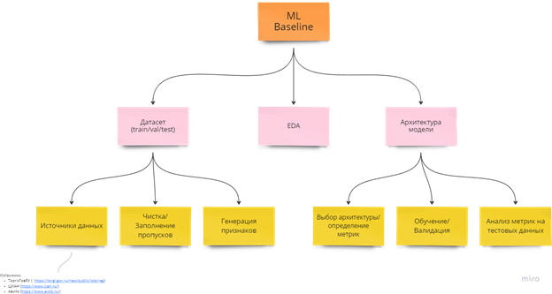
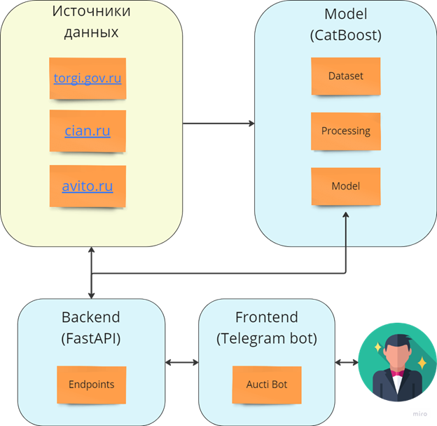

# AuctiML
## Проект по оценке лотов на торгах

## 1. Цели и предпосылки

### 1.1. Зачем идем в разработку продукта?
Бизнес-цель Product Owner
Научиться предсказывать результаты торгов по земельным участкам с сайта, которые выкладывают на сайт https://torgi.gov.ru/new/public/lots/reg 
Можем предсказывать результаты торгов: состоялись, не состоялись - заявился один участник, не состоялись - не заявился никто. 
Или предсказывать финальную цену, за которую уйдет лот. 
Почему станет лучше, чем сейчас, от использования ML Product Owner & Data Scientist
Сейчас пользователь должен вручную смотреть результаты прошлых торгов и руками анализировать, заявится ли кто-то на них, до какой цены доходили другие лоты. У нас несколько целевых сегментов: 
застройщики - ищут участки для застройки и перепродажи участков с домом
индивидуалы - ищут участок, чтобы построить дом
риелторы - ищут участки для клиентов или переуступки
инвесторы - ищут участки для долгосрочных вложений
Наша система будет предсказывать результат торгов для новых лотов, которые только выставили на торги. Пользователь может использовать данные для принятия решения: участвовать или нет в торгах по этому лоту, а не анализировать каждый лот вручную. 
Что будем считать успехом итерации с точки зрения бизнеса Product Owner
Написать парсер данных
Собрать dataset для обучения
Обучить модель с точностью <определить, с какой точностью и какие метрики будем использовать> 

### 1.2. Бизнес-требования и ограничения
Краткое описание БТ и ссылки на детальные документы с бизнес-требованиями Product Owner
<Найти пример>
Бизнес-ограничения Product Owner
Что мы ожидаем от конкретной итерации Product Owner.
Описание бизнес-процесса пилота, насколько это возможно - как именно мы будем использовать модель в существующем бизнес-процессе? Product Owner

## Что считаем успешным пилотом? Критерии успеха и возможные пути развития проекта Product Owner
### 1.3. Что входит в скоуп проекта/итерации, что не входит
На закрытие каких БТ подписываемся в данной итерации Data Scientist
Что не будет закрыто Data Scientist
Описание результата с точки зрения качества кода и воспроизводимости решения Data Scientist
Описание планируемого технического долга (что оставляем для дальнейшей продуктивизации) Data Scientist

### 1.4. Предпосылки решения
Описание всех общих предпосылок решения, используемых в системе – с обоснованием от запроса бизнеса: какие блоки данных используем, горизонт прогноза, гранулярность модели, и др. Data Scientist

## 2. Методология
### 2.1. Постановка задачи

Основная задача проекта разработать модель предсказывающую итоговую цену, за которую может быть продан земельный участок.  
 
Признаковое пространство:  
   - Информация о земельном участке, общие характеристики (площадь, месторасположение), информация об обременениях (суды, ипотека), другие базовые признаки, доступные из описания объекта торгов.
   - Сгенерированные ГЕО признаки (например, удаленность от ЖД, ближайшие города).
   - Статистика по району (например, плотность населения, средний возраст).
   - Сгенерированные признаки - производные признаки рассчитанные на базе других признаков.

Целевая функция: итоговая цена земельного участка, на момент завершения торгов  

Дополнительные задачи проекта:  
   1. Определить вероятность того, что торги состояться (задача классификации)  
   2.  Предсказать итоговую цену земельного участка по завершению торгов (задача регрессии)
   3. Найти “выгодные” варианты (задача классификации)

### 2.2. Блок-схема решения

### 2.3. Этапы решения задачи
   - Этап 1 - Подготовка данных.
   - Этап 2 - Подготовка прогнозных моделей
   - Этап 3 - Интерпретация моделей (согл. с заказчиком)
   - Этап 4 - Интеграция бизнес правил для расчета бизнес-метрик качества модели
   - Этап 5 - Подготовка инференса модели по итерациям
   - Этап 6 - Интеграция бизнес правил
   - Этап 7 - Разработка оптимизатора (выбор оптимальной итерации)
   - Этап 8 - Подготовка финального отчета для бизнеса
   
## 3. Подготовка пилота
### 3.1. Способ оценки пилота
Пилотный проект решения (MVP) будет представлять чат-бот. Пользователь направляет в чат-бот ссылку на объект торгов с сайта [https://torgi.gov.ru](https://torgi.gov.ru).   
В ответ пользователю сообщается:
 - предсказанная рыночная цена объекта,
 - отклонение от указанной цены, рекомендации по объекту
 - уровень ликвидности объекта.
 
### 3.2. Домен данных
 - Датасет представляет собой табличные данные об объектах недвижимости.
 - Базовые признаки объекта:
 - Вид разрешенного использования,
 - Кадастровый номер,
 - Адрес,
 - Площадь,
 - Краткое описание лота,
 - Подробное описание лота,
 - Договор аренды,
 - Дата публикации,
 - Дата окончания подачи заявки,
 - Дата торгов,
 - Стартовая цена,
 - Шаг аукциона,
 - Комиссия организатора,
 - Результат торгов: состоялся/не состоялся/аннулирован
 
В качестве целевой функции будет использоваться “финальная цена лота”.
  
Помимо базовых признаков также будет использоваться дополнительные данные из внешних источников: геопризнаки (например, удаленность от ЖД, ближайшие города), статистика по районам (например, плотность населения, средний возраст). Также будет выполнена генерация дополнительных признаков -  производные признаки рассчитанные на базе других признаков.
  
Признаковое пространство будет содержать числовые и категориальные признаки. Категориальные признаки будут обрабатываться для представления в числовом виде.   

### 3.2. Выбор архитектуры решения
При построении моделей будут использоваться бустинг деревья. Данный выбор обусловлен следующими соображениями:    
1. При работе с табличными данными деревья демонстрируют лучшие показатели чем нейронные сети и линейные модели.
2. Категориальные признаки будут обрабатываться внутренними механизмами CatBoost, что позволит уменьшить время разработки и позволит исключить возможные ошибки.
3. При использовании деревьев нормализацию признаков не требуется производить, что позволит уменьшить время разработки и позволит исключить возможные ошибки.

### 3.3. Что считаем успешным пилотом
Успешность пилота определяется по следующим критериям:
1. Точность работы модели
2. Интерпретируемость ответа решения

Достижение заданных метрик определяется отдельно для каждого вида генерируемой информации:    
1. Предсказанная рыночная цена объекта. Метрика модели MAE и MAPE между предсказанной ценой и реальной стоимостью объекта. 
2. Уровень ликвидности объекта. Метод модели классификации будет оцениваться через ROC AUC в случае наличия достаточного объема ликвидных объектов, либо экспертным путем 
3. Интерпретируемость рекомендаций по объекту будут оцениваться экспертным путем.

Оценка экспертным путем подразумевает участие представителей команды и внешних привлеченных экспертов.  

Проект будет считаться успешным при соблюдении следующих условий:  
1. Уровень предсказания рыночной цены объекта MAPE - 5-10% 
2. Уровень ликвидности объекта. Модель при threshold = 0.8 успешно определяет ликвидность объекта в 85% случаях
3. Интерпретируемость является достаточной и полной для принятия решения о приобретении объекта.

Дополнительным условием успешности проекта является нахождением заинтересованных лиц в дальнейшем развитии проекта.  

### 3.3. Подготовка пилота
В качестве целевых моделей планируется использовать бустинг деревьев. Использование GPU в проекте не планируется. Все расчеты планируется выполнять на локальных компьютерах участников команды.
  
Наибольшие вычислительные затраты будут в процессе генерации сложных признаков. В случае превышения доступных вычислительных лимитов будет выполнятся пересмотр алгоритм по генерации признаков, отказ от ряда “дорогих” по вычислительным затратам признаков, поиск дополнительных мощностей.
  
Вычислительная сложность модели закладывается как минимальная.

## 4. Внедрение для production систем, если требуется
### 4.1. Архитектура решения

### 4.2. Описание инфраструктуры и масштабируемости
Выбор инфраструктуры внедрения MVP будет определен на последующих этапах.
### 4.3. Требования к работе системы
Будут определены на последующих этапах.
### 4.4. Издержки
Будут определены на последующих этапах.
### 4.5. Integration points
Будут определены на последующих этапах.
### 4.6. Риски
Будут определены на последующих этапах.
  

  

